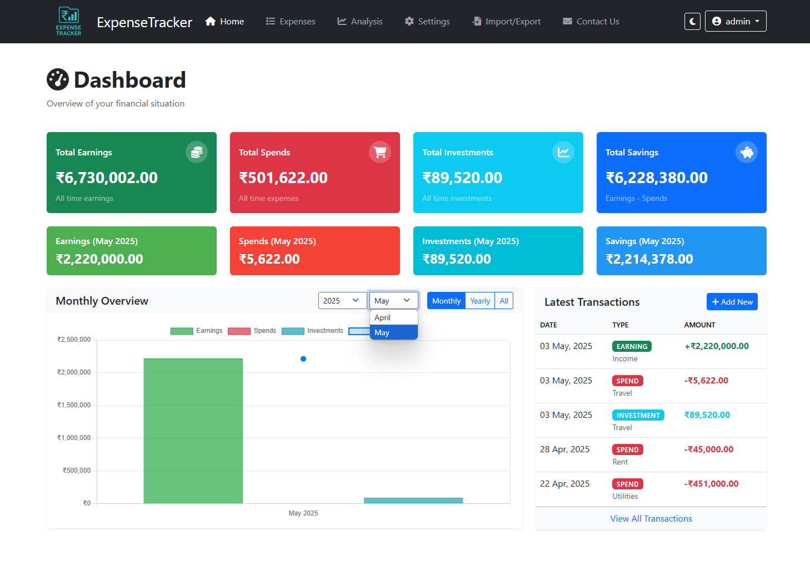

# Expense Tracker

<p align="center">
  
</p>


## Overview
A simple and intuitive expense tracking application that helps you monitor your spending habits and manage your budget effectively.

## Why was this needed?

1. **I don't trust expense tracker apps:** Most commercial apps store your sensitive financial data in the cloud, which I am not comfortable with.
2. **Open source alternatives were lacking:** Projects like Expense Owl and others on GitHub didn't have the features I needed, especially the ability to view yearly trends and breakdowns.
3. **A vibe coding experiment:** As a Machine Learning Engineer with limited frontend experience, I wanted to see how far I could go building a full-stack app using AI assistance and vibe-driven coding.

## Features

- **User Authentication**: Secure login/logout with Flask-Login.
- **Expense Management**: Add, edit, delete, and search financial records.
- **Categories & Types**: Customizable categories; supports Earning, Spend, and Investment types.
- **Dashboard**: Visual summary of earnings, spends, investments, and savings.
- **Analysis**: Interactive charts for monthly/yearly trends and category breakdowns.
- **Settings**: Manage categories, currency, and month start date.
- **Import/Export**: Backup or restore data in CSV/JSON formats.
- **Responsive UI**: Works on desktop and mobile devices.
- **Dark Mode**: Full dark theme support for comfortable viewing in low-light environments.
- **No Cloud Dependency**: All data is stored locally.

---

## Changelog

The project follows [Semantic Versioning](https://semver.org/). View the full changelog:

- [CHANGELOG.md](CHANGELOG.md) - Complete version history
- **Current Version:** 0.1.0 (Pre-release) - Initial release with core features

---

## Screenshots
> 

**[View all screenshots](docs/show.md)**

## Getting Started

### 1. Clone the Repository

```bash
git clone https://github.com/yourusername/expense-tracker.git
cd expense-tracker
```

### 2. Install Dependencies

It is recommended to use a virtual environment.

```bash
python -m venv venv
source venv/bin/activate  # On Windows: venv\Scripts\activate
pip install -r requirements.txt
```

### 3. Configure Environment

You can configure the application in two ways:

#### Option A: Using Initialization Scripts

The repository includes initialization scripts for different operating systems that will set up the required configuration files with secure defaults:

- **Windows:** Run `scripts\init_windows.bat` from the repository root
- **Linux:** Run `bash scripts/init_unix.sh` from the repository root
- **macOS:** Run `bash scripts/init_macos.sh` from the repository root

These scripts will create:
- A `.env` file with a randomly generated secure key
- A default `config.yaml` with an admin user (username: `admin`, password: `admin123`)
- A `data` directory if needed

**Important:** Remember to change the default password in `config.yaml` after initialization.

#### Option B: Manual Configuration
- Go to `scripts` directory
- Copy `.env.example` to `.env` and set your `SECRET_KEY`.
- Edit `config.yaml` to add users if needed.

### 4. Run the Application

```bash
python app.py
```

- Visit [http://127.0.0.1:5000](http://127.0.0.1:5000) in your browser.

---

## Configuration

- **Users:** Managed in `config.yaml`.
- **Settings:** Each user has a settings JSON in `data/`.
- **Data:** Each user's expenses are stored as CSV in `data/`.

---

## Usage

- **Login:** Use the demo credentials or add your own in `config.yaml`.
- **Dashboard:** View financial summary and recent transactions.
- **Expenses:** Add, edit, delete, and search records.
- **Analysis:** Visualize trends and breakdowns.
- **Settings:** Customize categories, currency, and month start.
- **Import/Export:** Backup or restore your data.

---

## Folder Structure

```
expense-tracker/
│
├── app.py                  # Main Flask application
├── config.yaml             # User configuration
├── requirements.txt        # Python dependencies
├── .env.example            # Example environment variables
├── data/                   # User data and settings (CSV/JSON)
├── static/
│   ├── css/                # Custom styles
│   └── js/                 # Custom JavaScript
├── templates/              # Jinja2 HTML templates
│   ├── base.html
│   ├── dashboard.html
│   ├── expenses.html
│   ├── analysis.html
│   ├── settings.html
│   ├── import_export.html
│   ├── profile.html
│   ├── contact.html
│   └── login.html
└── README.md
```

---

## Technologies Used

- **Backend:** Python, Flask, Flask-Login, Flask-WTF, pandas, PyYAML
- **Frontend:** Bootstrap 5, Font Awesome, Chart.js, Vanilla JS
- **Data Storage:** CSV/JSON files (per user, local)
- **Other:** dotenv for environment variables

---

## Contributing

Contributions are welcome! Please check out our [Contributing Guide](CONTRIBUTING.md) for details on how to:

1. Fork the repository
2. Create a new branch for your feature/fix
3. Submit a pull request with a clear description

---

## License

This project is licensed under the [Apache License 2.0](LICENSE).

---

## Disclaimer

**This is a vibe coding project** — built for personal use and learning, with an emphasis on creativity and exploration rather than enterprise-grade reliability. Use and modify for your own needs!

---

<!--
You can add a logo image here by placing a logo file in the repository and linking to it:

-->