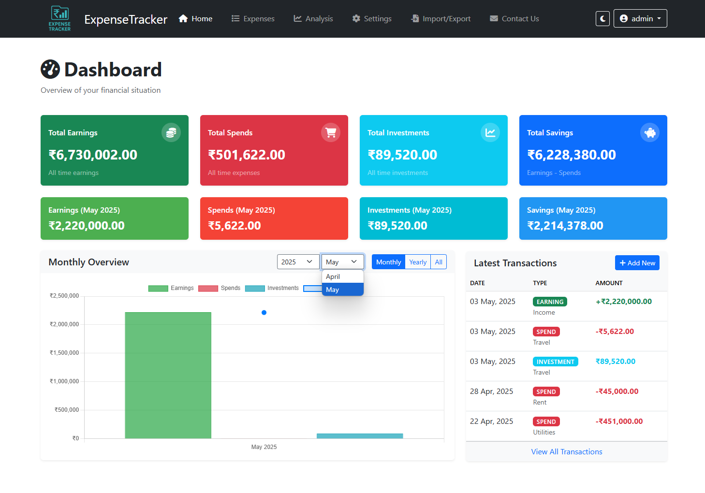
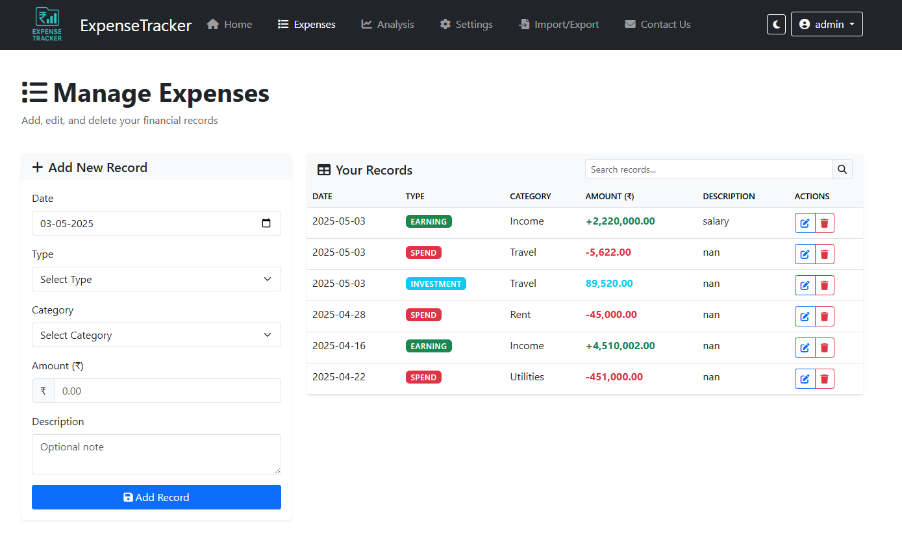
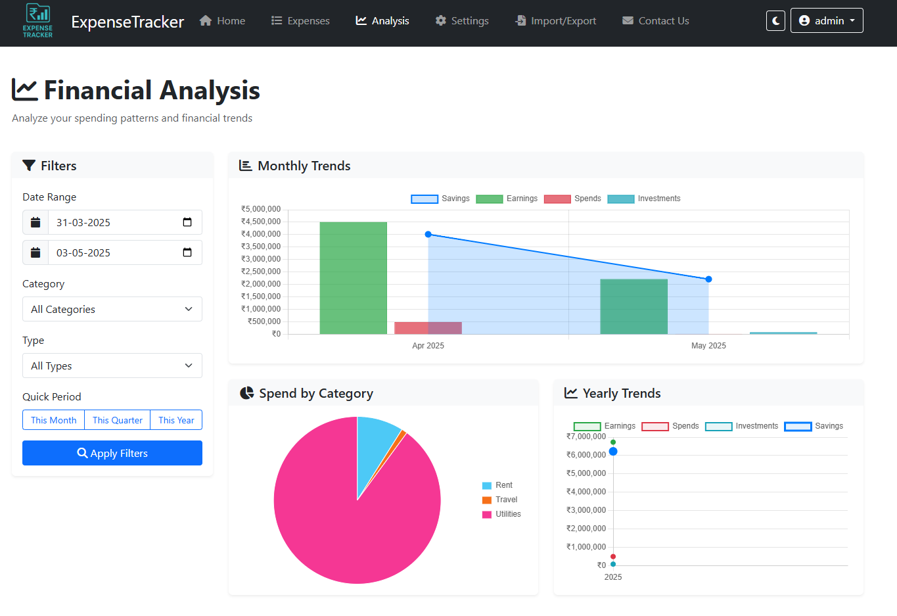
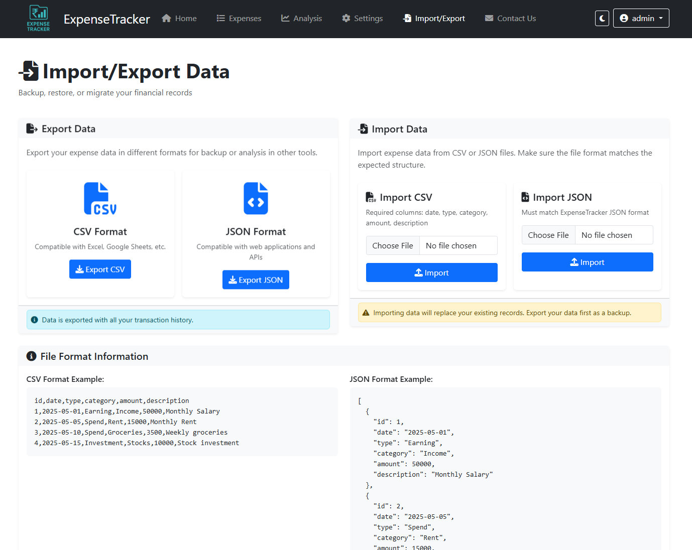
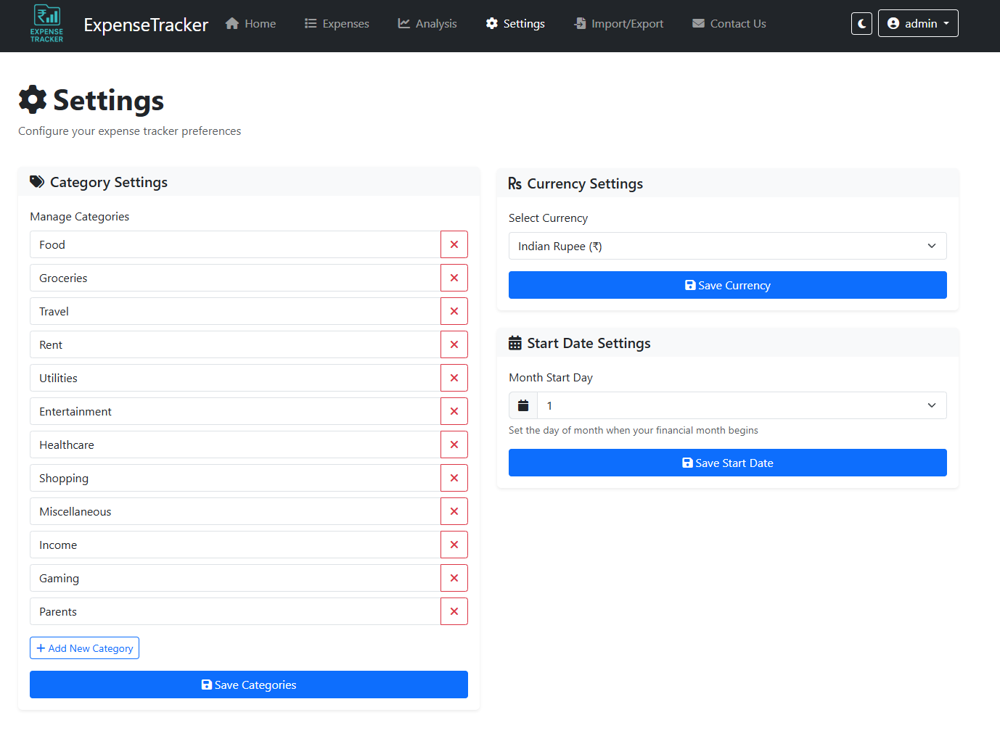

# ExpenseTracker Screenshots

This page contains all screenshots of the ExpenseTracker application to showcase its features and interface.

## Dashboard

**Dashboard Overview:** The main control center that provides a quick financial summary with income, expenses, investments, and savings at a glance. Features recent transactions and interactive charts showing monthly distribution of your finances.

## Expense Management

**Expense Tracker:** A comprehensive view of all your financial records with powerful filtering and sorting capabilities. Add, edit, and delete transactions easily while categorizing them as earnings, expenses, or investments.

## Financial Analysis

**Financial Analysis:** Detailed visual breakdowns of your spending habits with category-wise analysis and trend charts. Compare monthly and yearly data to identify patterns and make informed financial decisions.

## Import/Export

**Data Management:** Seamlessly backup your financial data or restore from previous exports. Compatible with CSV and JSON formats for easy migration and data preservation with no cloud dependency.

## Settings

**Customization Options:** Personalize your experience by managing expense categories, setting preferred currency, adjusting the month start date, and toggling between light and dark themes for comfortable viewing.